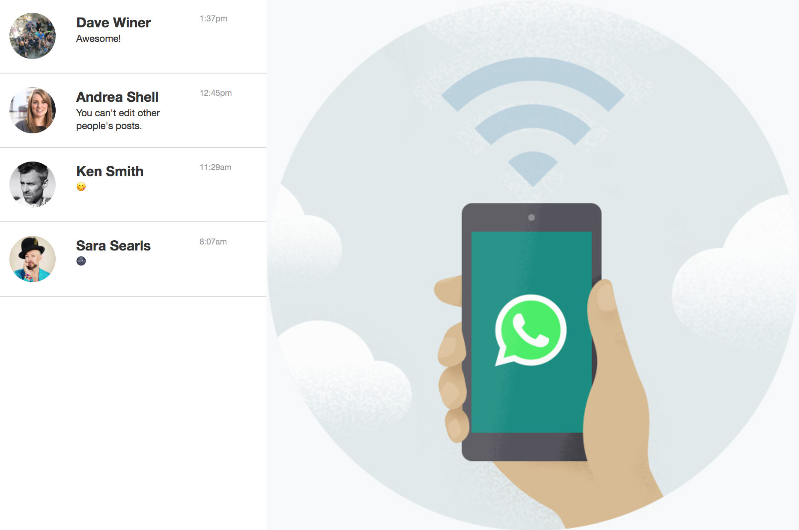
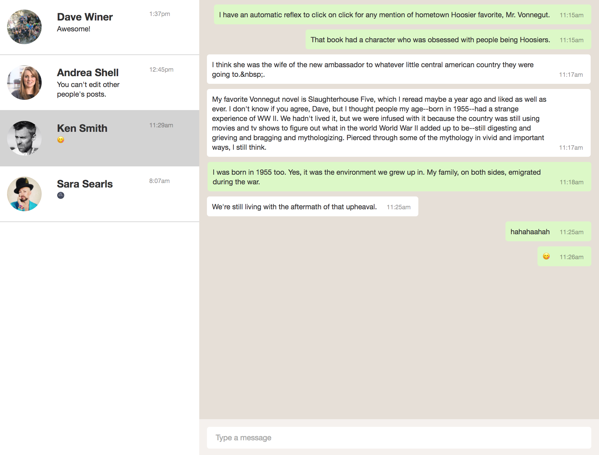

# React Challenge

* We should do an interface pretty close to WhatsApp Web, yes they have used React!!  
* There is Bootstrap (from Twitter), so you can use all the components such as grid system 
* There are two components to do: contact list and chat per contact.
* Please review the comps

## Contact list

Show the following elements:

* User photo
* User name
* Last message	
* Last time he/she was connected

## Chat per contact 

* By default, this image must be rendered `http://localhost:3009/default.jpg`
* Once I click an user from Contact List, the chat content should be replaced by the conversation.
* Keep in mind the flag for each Chat item object, in order to make them yours or from your Contact.
* Each Chat item should show the time it was sent.

> All the images are on the API project, so you can access to them on this way `http://localhost:3009/dave.jpg`. Only replace the name of the image

## Run the projects

* API
	* Clone this repo from `master` `https://github.com/larrotta69/huge-react-codechallenge-api.git` 
	* Then go to `/huge-react-codechallenge-api` folder
	* Run `npm install`
	* Run `npm start`
	* Look for `http://localhost:3009/contacts/`


* React Project
	* Clone this repo from `code-challenge` `https://github.com/larrotta69/hackathon-huge.git` 
	
	```sh
	git clone -b code-challenge https://github.com/larrotta69/hackathon-huge.git
	```
	
	* Then go to `/hackathon-huge` folder
	* Run `npm install`
	* Run `npm start`
	* Wait for `http://localhost:3000/`

## Folder structure

* Inside `/src` folder you will find the `/components` and `/styles` folders. Also the `index.js` and `routes.js` files
* `index.js` is rendering the Router component.
* `routes.js` is exporting the "/" route and rendering the `HomePage` component
* Inside `/styles` you will find the `main.scss`, so you can create your folders for SASS components or just put the styles on this file.
* Inside `/components` you will find `App.js`. This component is playing as a "container", there is just a render of their childerns
* Inside `/components/home` you will find `HomePage.js`. Our recommendation is to work from here, you can import your components and use them here,
* Feel free to structure your project components as you want

> Don't worry about server and React, all is wired up for you! 

## Helpers
This will help you:

```css
$WA-brown: #e6dfd7;
$WA-green-message: #dcf8c7;

.WA-chat-item {
	background: white;
	margin: 10px 0;
	border-radius: 5px;
	padding: 10px;
	position: relative;
	display: table;
    padding-right: 80px;
	p {
		margin: 0;
		display: inline-block;
	}
	span {
		position: absolute;
		right: 25px;
		bottom: 10px;
	}
	&.WA-chat-item-mine {
		background: $WA-green-message;
		margin-right: 0;
		margin-left: auto;
	}
	time {
		position: absolute;
		bottom: 10px;
		right: 15px;
	}
}

.WA-rounded-image{
	width: 100%;
	border-radius: 50%;
}

.WA-contact-name{
	font-size: 20px;
}
 
time {
	opacity: 0.5;
	font-size: 12px;
}

```

## Plus Task Helpers
```js
//Make PUT method to API
fetch(`${API_DOMAIN}/contacts/${idYouWantUpdate}`, {
	method: "PUT",headers: {'Content-Type':'application/json'},
	body: JSON.stringify(yourData)
})

//Time format
new Date().toLocaleTimeString('en-US', { hour: 'numeric', hour12: true, minute: 'numeric' })

//Serialize the sent data from Form
import serializeForm from 'form-serialize'
const values = serializeForm(event.target, { hash: true })
```

```css
input {
	border: 1px solid white;
	box-sizing: border-box;
	padding: 16px;
	border-radius: 5px;
	width: 100%;
	font-size: 15px;
 }

 .WA-chat-form-wrapper {
	position: absolute;
	bottom: 0;
	left: 0;
	right: 0;
	padding: 15px;
	background: $WA-brown-light;
 }
```

## Comps



&nbsp;
&nbsp;
&nbsp;

